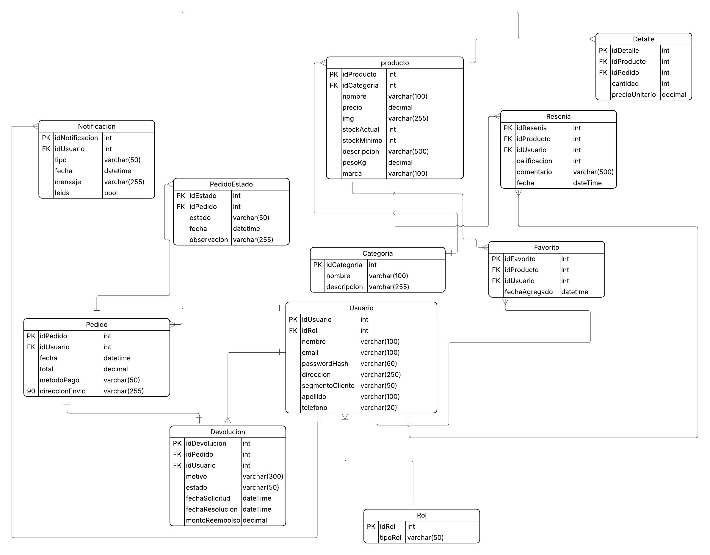

# Huellitas - Pet Shop Online 

**De Front-End a Full Stack**

Bienvenidos a **Huellitas**! Lo que comenzó como un proyecto de curso se transformó en una aplicación web robusta y escalable. Este e-commerce cuenta con una arquitectura moderna donde el Front-End ha evolucionado hacia una **Single Page Application (SPA)** en React que consume datos de una **API propia** conectada a una base de datos relacional.

**[Ver Demo en Vivo](https://dominguezmicaela.github.io/petshopHuellitas/)**

---

## Arquitectura y Tecnologías

El proyecto ha sido reestructurado íntegramente para funcionar bajo un esquema de tres capas:

### 1. Backend
* **Framework:** desarrollado con **.NET / C#**.
* **Arquitectura:** basada en controladores y servicios con clara separación de responsabilidades.
* **Hosting:** desplegado en **Render**.
* **Patrones de diseño:**
  * **Repository Pattern:** para abstraer y desacoplar el acceso a los datos.
  * **DTO (Data Transfer Object):** aplicado para una transferencia segura de datos entre capas.
  * **Inyección de Dependencias (DI):** para mejorar la modularidad y testabilidad.
* **Estructura de Solución:**
  * `Huellitas.API`: controladores y endpoints.
  * `Huellitas.Service`: lógica de negocio y validaciones.
  * `Huellitas.Data`: contexto de base de datos y repositorios.
  * `Huellitas.Core`: entidades fundamentales e interfaces.
* **ORM:** **Entity Framework Core** con enfoque *Code First*.

### 2. Base de Datos
* **Motor:** **PostgreSQL**.
* **Cloud:** alojada en **Neon**.
* **Modelado:** diseño relacional normalizado para asegurar la consistencia.

### ## Estructura de base de datos

El modelo incluye las siguientes entidades:

| Entidad | Descripción |
|---|---|
| `Usuario` | Datos del cliente, autenticación y segmentación |
| `Rol` | Control de acceso por tipo de usuario |
| `Producto` | Catálogo con stock, precio, peso y marca |
| `Categoria` | Clasificación de productos |
| `Pedido` | Órdenes de compra con método de pago y envío |
| `Detalle` | Líneas de cada pedido (cantidad y precio unitario) |
| `PedidoEstado` | Historial de estados del pedido |
| `Devolucion` | Gestión de reembolsos y devoluciones |
| `Resenia` | Calificaciones y comentarios de productos |
| `Favorito` | Productos guardados por usuario |
| `Notificacion` | Sistema de alertas internas por usuario |

### 3. Frontend
* **Tecnologías:** React, Vite, JavaScript (ES6+), CSS3 (Flexbox/Grid).
* **Navegación:** Implementación de **React Router Dom** para la gestión de rutas y paneles administrativos.
* **Persistencia Local:** Uso de **LocalStorage** para la gestión del carrito de compras.
* **Hosting:** Desplegado en **GitHub Pages**.

---

## Funcionalidades Destacadas

* **Catálogo Dinámico:** Los productos se cargan en tiempo real consumiendo los endpoints de la API.
* **Carrito de Compras:** sistema persistente para agregar, eliminar y gestionar pedidos.
* **Diseño Responsive:** interfaz optimizada para celulares, tablets y computadoras de escritorio.[En progreso]
* **Documentación API:** endpoints totalmente documentados y testeables mediante **Swagger UI**.
 
---

## Metodología de Desarrollo

* **AI-Assisted Development:** Uso de herramientas de **IA** para la optimización de algoritmos, refactorización de código y sugerencias de arquitectura.
* **Control de Versiones:** Flujo de trabajo basado en **Feature Branches** y adopción de **Conventional Commits** para un historial limpio y profesional.
* **Documentación:** Mantenimiento constante de la documentación técnica del proyecto.
* **Kanban:** Gestión del flujo de trabajo mediante tablero Kanban para organizar y priorizar tareas de forma visual e iterativa.
---

## Stack 

* 
* 
* 
* 
* 
* 
* 

## Aviso Legal
Este proyecto fue desarrollado exclusivamente con **fines educativos**. 
* **Imágenes y Datos:** Se han utilizado herramientas de automatización para datasets con fines de demostración técnica. Los derechos pertenecen a sus respectivos dueños.
* **Propósito:** Demostración de habilidades en arquitectura de software, gestión de bases de datos y desarrollo Full Stack.

*Proyecto realizado por Micaela Belen Dominguez.*
